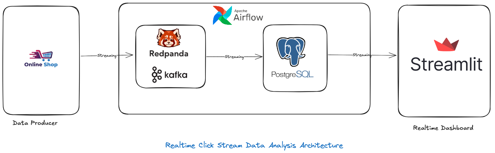

# **Real-Time Clickstream Analytics Dashboard**



A real-time analytics solution for processing, storing, and visualizing clickstream data using **Redpanda (Kafka)**, **PostgreSQL**, **Apache Airflow**, and **Streamlit**.

## **Project Overview**

This project demonstrates a complete end-to-end pipeline  for managing real-time clickstream data generated from a web application. The system ingests, processes, stores, and visualizes user interaction data in real time.

### **Key Features**
- **Real-time Ingestion**: Redpanda (Kafka-compatible) is used as the message broker for collecting clickstream data.
- **Data Processing and Storage**: Data is consumed from Redpanda, transformed, and stored in PostgreSQL for querying.
- **ETL Automation**: Apache Airflow orchestrates the ETL pipeline for periodic data transformations and aggregations.
- **Interactive Dashboard**: Streamlit visualizes key metrics like the most popular pages, number of clicks per page, and most added-to-cart products in real time.

---

## **Data Architecture**

### **1. Data Ingestion**
- **Redpanda** serves as the backbone of the real-time messaging layer, capturing clickstream data from various producers. Events include user interactions such as page visits, clicks, and "add to cart" actions.

### **2. Data Processing**
- A **Python Kafka consumer** consumes data from Redpanda topics and performs basic transformations.
- Processed events are inserted into **PostgreSQL**, ensuring idempotency and avoiding duplicate records.

### **3. Orchestration**
- **Apache Airflow** automates periodic tasks such as aggregating data for precomputed metrics and maintaining the database.

### **4. Data Visualization**
- **Streamlit** provides an interactive and real-time dashboard to monitor:
  - Most popular pages.
  - Number of clicks per page.
  - Most frequently added-to-cart products.

---

## **Tech Stack**

| Component        | Description                                                                 |
|------------------|-----------------------------------------------------------------------------|
| **Redpanda**     | Kafka-compatible message broker for real-time data ingestion.              |
| **PostgreSQL**   | Relational database for persisting clickstream data and storing aggregations. |
| **Apache Airflow** | Workflow orchestration for automating ETL pipelines.                      |
| **Streamlit**    | Interactive web application framework for real-time data visualization.    |
| **Python**       | Core language for the Kafka consumer, ETL scripts, and dashboard logic.    |

---

## **Project Workflow**

1. **Generate Clickstream Data**:  
   Simulated clickstream events are published to a Redpanda topic.

2. **Ingest and Transform Data**:  
   A Python Kafka consumer listens to the topic, deserializes the data, and writes it to PostgreSQL.

3. **Orchestrate Pipelines**:  
   Airflow DAGs perform scheduled tasks for aggregations and housekeeping.

4. **Visualize Metrics**:  
   Streamlit queries PostgreSQL in real time and renders key business metrics.

---
## **Metrics Tracked**
- **Most Popular Pages**: Top pages by user visits.
- **Clicks Per Page**: Number of clicks for each page.
- **Most Added to Cart Products**: Products frequently added to users' carts.

---

## **Future Enhancements**
- Migrate to **Cassandra** and **Apache Spark** for scalable storage and distributed processing.
- Implement **event deduplication** using Kafka Streams or ksqlDB.
- Add **real-time alerts** for unusual user behaviors using Python or Spark Streaming.
- Use **CI/CD pipelines** to deploy the dashboard and services automatically.


---
## **Setup Instructions**

### **Prerequisites**
- Docker and Docker Compose installed.
- Python 3.8 or higher installed.

### **1. Clone the Repository**
```bash
git clone https://github.com/maodo/clic_kstream-analysis.git
```

---

## **License**
This project is licensed under the MIT License. See the `LICENSE` file for details.
